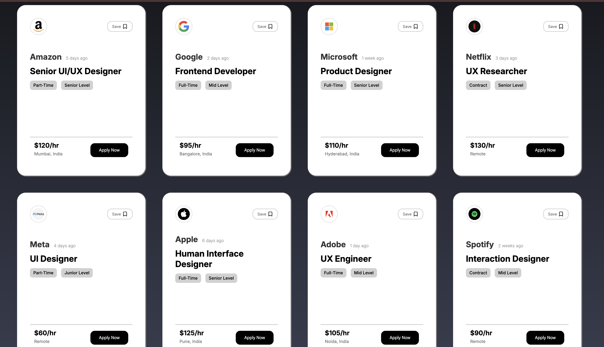

# 💼 React Job Listing UI

A clean and modern **UI-only job listing interface** built using **React**.
This project focuses on layout, component structure, and visual design rather than backend functionality.

> 🌱 This is my **first project using React**, created to practice component-based architecture and UI development.

---

## ✨ Features

* 📄 Job listing cards with company details
* 🏷️ Job tags (Full-time, Part-time, Contract, Level)
* 💰 Hourly pay display
* 📍 Location / Remote indicator
* 🔘 Reusable UI components
* 🎨 Clean, modern, and consistent design

---

## 🛠️ Tech Stack

* ⚛️ **React**
* 🧠 **JavaScript (ES6+)**
* 🎨 **CSS**
* ⚡ **Vite** (for development & bundling)

---

## 📌 Project Status

🚧 **UI Only**
This project currently focuses on the frontend UI. Functionality such as filtering, saving jobs, or applying is not implemented yet.

Planned improvements:

* Add interactivity using `useState`
* Job filtering & search
* Save job feature (localStorage)
* Responsive enhancements

---

## 📸 Preview



---

## 🚀 Getting Started

To run this project locally:

```bash
npm install
npm run dev
```

---

## 🎯 Learning Goals

* Understand React component structure
* Practice passing data using props
* Improve UI layout and spacing
* Build confidence with React fundamentals

---

## 🧑‍💻 Author

Made with ❤️ while learning React.

---

## 📜 License

This project is open-source and free to use for learning purposes.
